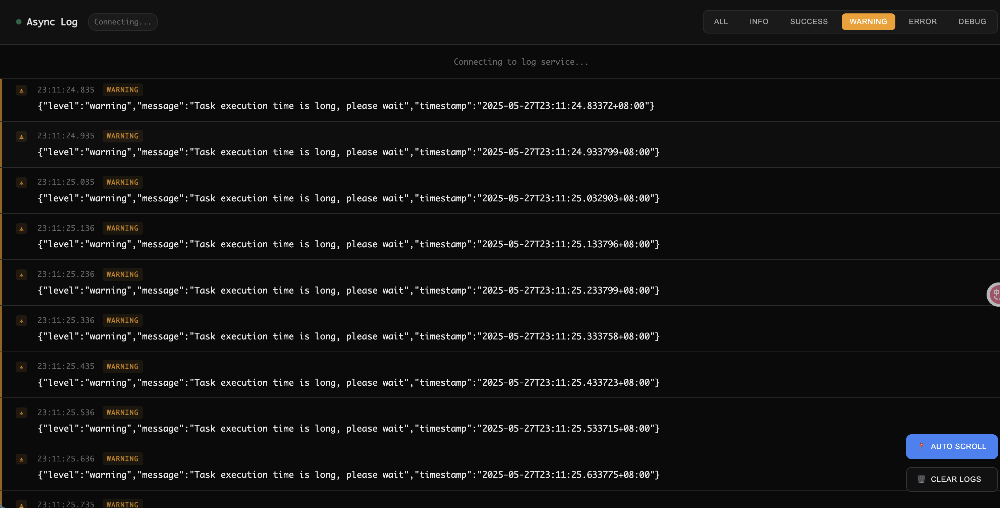

# GoRoom

GoRoom is a real-time log streaming server built with Go, providing a modern and interactive web interface for monitoring application logs. It uses Server-Sent Events (SSE) for efficient real-time communication.



## Features

- 🚀 Real-time log streaming using Server-Sent Events (SSE)
- 🎨 Modern, responsive web interface
- 📊 Multiple log levels (Info, Success, Warning, Error, Debug)
- 🔍 Log filtering by level
- 📝 Timestamp for each log entry
- 🔄 Auto-scroll with manual control
- 🎯 Room-based log separation
- 💻 Cross-platform support
- 🔌 Multiple router support (Gorilla Mux and Gin)

## Installation

```bash
go get github.com/xxlv/goroom
```

## Quick Start

### Using Gorilla Mux

```go
package main

import (
    "log"
    "net/http"
    "github.com/gorilla/mux"
    "github.com/xxlv/goroom"
)

func main() {
    router := mux.NewRouter()
    sseServer := goroom.NewServer()
    sseServer.Mount(router, "/events")

    // Example: Send logs to room1
    go func() {
        sseServer.WriteInfof("room1", "Application started")
        sseServer.WriteSuccessf("room1", "Database connected successfully")
        sseServer.WriteWarningf("room1", "High memory usage detected")
        sseServer.WriteErrorf("room1", "Failed to process request")
        sseServer.WriteDebugf("room1", "Processing request ID: %s", "12345")
    }()

    log.Println("Server starting on :8080")
    if err := http.ListenAndServe(":8080", router); err != nil {
        log.Fatal(err)
    }
}
```

### Using Gin

```go
package main

import (
    "log"
    "github.com/gin-gonic/gin"
    "github.com/xxlv/goroom"
)

func main() {
    router := gin.Default()
    sseServer := goroom.NewServer()
    sseServer.Mount(router, "/events")

    // Example: Send logs to room1
    go func() {
        sseServer.WriteInfof("room1", "Application started")
        sseServer.WriteSuccessf("room1", "Database connected successfully")
        sseServer.WriteWarningf("room1", "High memory usage detected")
        sseServer.WriteErrorf("room1", "Failed to process request")
        sseServer.WriteDebugf("room1", "Processing request ID: %s", "12345")
    }()

    log.Println("Server starting on :8080")
    if err := router.Run(":8080"); err != nil {
        log.Fatal(err)
    }
}
```

## Usage

### Server API

```go
// Create a new server
server := goroom.NewServer()

// Mount the server to a router with a prefix
server.Mount(router, "/events")  // Supports both mux.Router and gin.IRouter

// Write logs to a room
server.WriteInfof(roomID, format, args...)    // Info level
server.WriteSuccessf(roomID, format, args...) // Success level
server.WriteWarningf(roomID, format, args...) // Warning level
server.WriteErrorf(roomID, format, args...)   // Error level
server.WriteDebugf(roomID, format, args...)   // Debug level

// Close a room
server.CloseRoom(roomID)
```

### Web Interface

Access the web interface at `http://localhost:8080/events/` with an optional room parameter:

```
http://localhost:8080/events/?room=room1
```

## Features in Detail

### Log Levels

- **Info**: General information messages
- **Success**: Successful operations
- **Warning**: Potential issues or concerns
- **Error**: Error conditions
- **Debug**: Detailed debugging information

### Web Interface Features

- Real-time log updates
- Filter logs by level
- Auto-scroll toggle
- Timestamp display
- Responsive design
- Dark theme
- Custom scrollbar

## Contributing

Contributions are welcome! Please feel free to submit a Pull Request.

## License

This project is licensed under the MIT License - see the LICENSE file for details.
